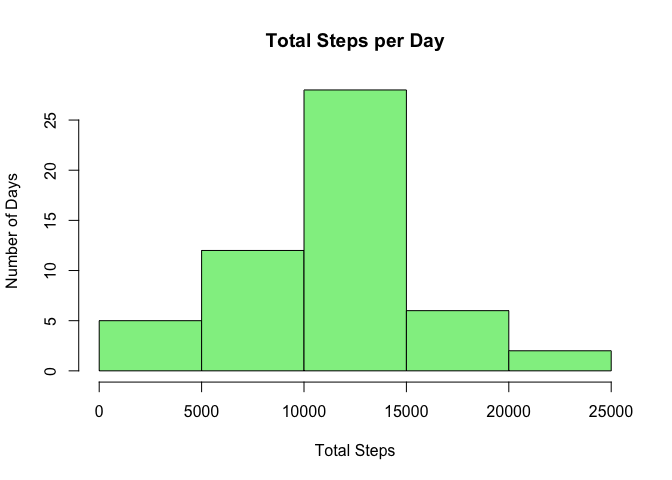
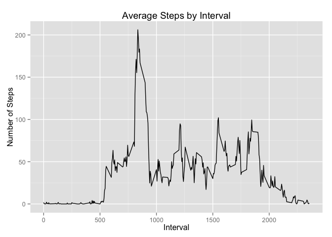
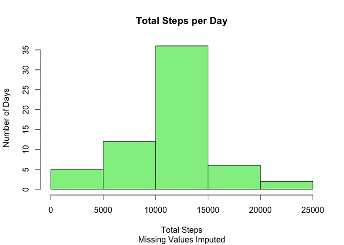
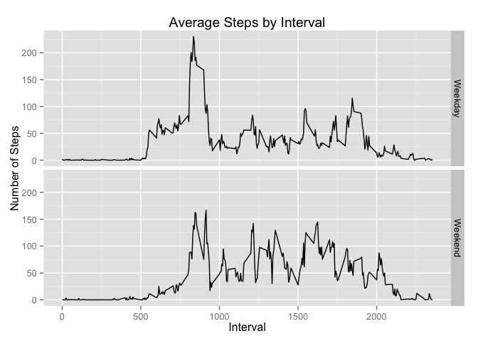

# Reproducible Research: Peer Assessment 1


## Loading and preprocessing the data
First, we load the data from the specified file:


```r
raw <- read.csv("activity.csv", header=T)
```

At this time, no preprocessing is performed.

## What is mean total number of steps taken per day?
Per the instructions, missing values are ignored at this step. I make use of 
the dplyr library for easier data manipulation.


```r
library(dplyr)
byDay <- raw %>% group_by(date) %>% summarize(total = sum(steps))
hist(byDay$total, xlab="Total Steps", ylab="Number of Days", main="Total Steps per Day", col="lightgreen")
```

 

```r
meanSteps <- mean(byDay$total, na.rm=T)
medianSteps <- median(byDay$total, na.rm=T)
```

From the code above, we learn that the mean number of steps per day is 
10766.2 and the median is 10765.

## What is the average daily activity pattern?
Again I use the dplyr library (loaded above) to group the data, this time by 
interval. I also calculate the average number of steps in each interval across 
all days.


```r
library(ggplot2)
byInterval <- raw %>% group_by(interval) %>% summarize(average = mean(steps, na.rm=T))
ggplot(byInterval, aes(x=interval, y=average)) + geom_line() +
  xlab("Interval") +
  ylab("Number of Steps") +
  labs(title = "Average Steps by Interval")
```

 

```r
maxInterval <- byInterval[which.max(byInterval$average),1]
```

From the code above, we learn that the most active interval was interval number 
835. This is also evidenced in the chart.


## Imputing missing values
First I calculate the number of observations in the data set with missing values:


```r
nMissingPoints <- sum(!complete.cases(raw))
```

This tells us that there are 2304 observations with missing values.
These missing values only occur in the "steps" variable, thus I focus on that 
variable for the imputation step. To impute the missing values, I use the mean 
number of steps for the interval, average over all days in the data set.


```r
imputed <- raw
missingIntervals <- imputed[is.na(imputed$steps),3]
missingIntervals <- sapply(missingIntervals, function(x) match(x, byInterval$interval))
imputedVals <- byInterval[missingIntervals,2]
imputed[is.na(imputed$steps),1] <- imputedVals
sum(!complete.cases(imputed))
```

```
## [1] 0
```

"imputed"" now contains the original data with missing entries replaced by the 
average number of steps taken in the corresponding interval across all days.
Next, I recreate the histogram of the average number of steps per day to explore
the effects of this imputation.


```r
imputedByDay <- imputed %>% group_by(date) %>% summarize(total = sum(steps))
hist(imputedByDay$total, xlab="Total Steps", ylab="Number of Days", 
     main="Total Steps per Day", sub="Missing Values Imputed", col="lightgreen")
```

 

```r
imputedMeanSteps <- mean(imputedByDay$total)
imputedMedianSteps <- median(imputedByDay$total)
```

The new mean number of steps per day is 10766.2 
and the median is 10766.2. The mean has not changed,
while the median has increased slightly.

## Are there differences in activity patterns between weekdays and weekends?
First we need to convert the date variable from the factor class to the date class,
then we create the weekday/weekend factor based on those results.


```r
day <- weekdays(as.Date(imputed$date))
dayType <- factor(day %in% c("Saturday", "Sunday"), labels = c("Weekday", "Weekend"))
imputed$dayType <- dayType
imputedByDayType <- imputed %>% group_by_(.dots=list(quote(interval), quote(dayType))) %>% 
  summarize(average = mean(steps))
ggplot(imputedByDayType, aes(x=interval, y=average)) + geom_line() + facet_grid(dayType~.) +
  xlab("Interval") +
  ylab("Number of Steps") +
  labs(title="Average Steps by Interval")
```

 

